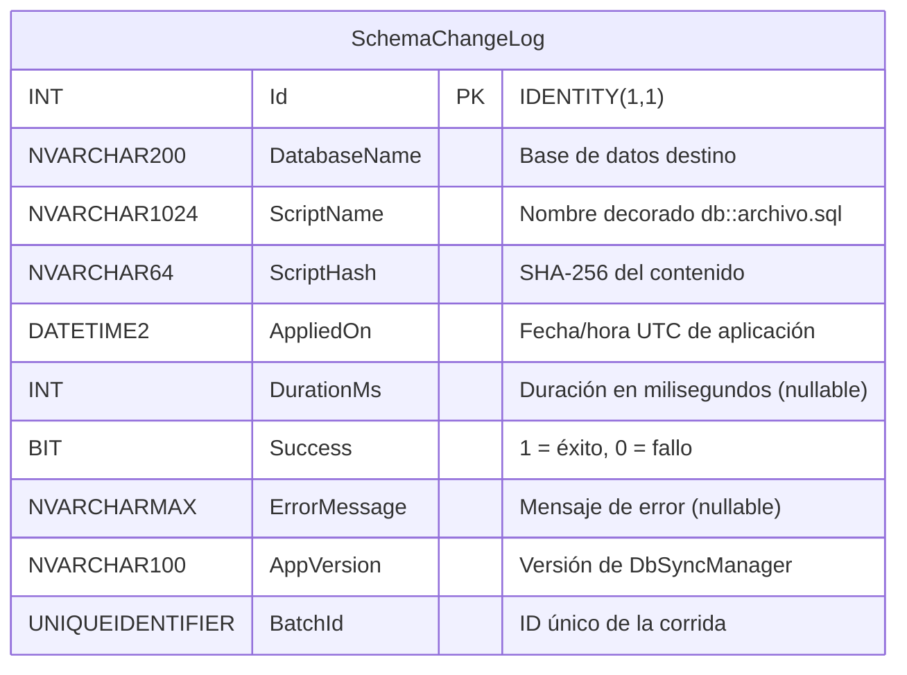
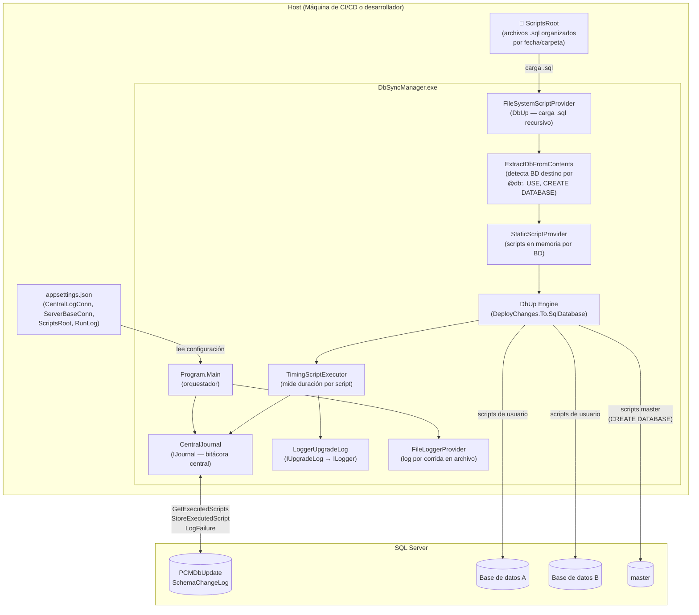
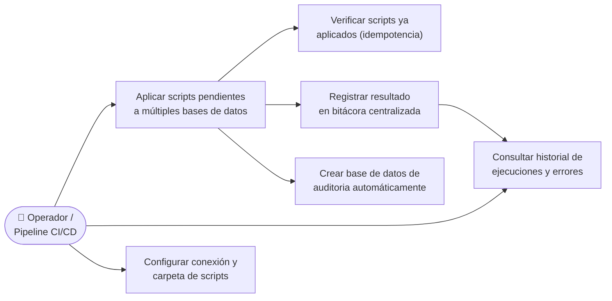

# DbSyncManager

**DbSyncManager** es una herramienta de línea de comandos desarrollada en **.NET 8** que automatiza la aplicación de scripts SQL a una o varias bases de datos SQL Server. Utiliza [DbUp](https://dbup.readthedocs.io/) como motor de ejecución y registra cada corrida en una base de datos de auditoría centralizada.

---

## Tabla de contenidos

1. [Descripción general](#descripción-general)
2. [Características principales](#características-principales)
3. [Requisitos](#requisitos)
4. [Configuración](#configuración)
5. [Convenciones de nombrado de scripts](#convenciones-de-nombrado-de-scripts)
6. [Uso](#uso)
7. [Funciones internas](#funciones-internas)
8. [Diagrama ER](#diagrama-er)
9. [Arquitectura de componentes](#arquitectura-de-componentes)
10. [Casos de uso](#casos-de-uso)

---

## Descripción general

DbSyncManager recorre de forma recursiva una carpeta de scripts SQL (`ScriptsRoot`), detecta automáticamente la base de datos destino de cada script (mediante una etiqueta de comentario o una sentencia `USE`) y aplica únicamente los scripts que aún no han sido ejecutados. Todos los resultados —éxitos, fallos, duración y hash del script— quedan registrados en la tabla `SchemaChangeLog` de una base de datos de auditoría.

---

## Características principales

| Característica | Descripción |
|---|---|
| **Detección automática de BD destino** | Lee el comentario `-- @db: <nombre>` o la sentencia `USE [<nombre>]` al inicio del script para enrutar la ejecución a la base correcta. |
| **Idempotencia** | Cada script se ejecuta **una sola vez** gracias al journal central. Las corridas posteriores omiten los scripts ya aplicados. |
| **Ejecución multi-base** | Un único proceso aplica scripts a múltiples bases de datos en la misma instancia SQL Server. |
| **Bitácora centralizada** | Registra nombre, hash SHA-256, duración, éxito/error y versión de la herramienta por cada script ejecutado. |
| **Transacciones por script** | Los scripts de bases de datos de usuario se ejecutan dentro de una transacción; los scripts de administración (`master`) se ejecutan sin transacción. |
| **Orden determinista** | Los scripts se ordenan por la fecha extraída del nombre/ruta (`yyyy.MM.dd`) y luego alfabéticamente. |
| **Log dual** | Emite logs por consola (formato de una línea) y en un archivo de texto por corrida, ambos configurables. |

---

## Requisitos

- [.NET 8 SDK](https://dotnet.microsoft.com/download/dotnet/8.0) o superior.
- SQL Server (o SQL Server Express) accesible desde la máquina donde se ejecuta la herramienta.
- Permisos para crear bases de datos y tablas en la instancia SQL Server de destino (necesarios la primera vez para crear `SchemaChangeLog`).

---

## Configuración

La aplicación lee su configuración desde `appsettings.json`, ubicado junto al ejecutable.

```json
{
  "CentralLogConn": "Server=.\\SQLEXPRESS;Database=PCMDbUpdate;Trusted_Connection=True;Trust Server Certificate=True;",
  "ServerBaseConn": "Server=.\\SQLEXPRESS;Trusted_Connection=True;Trust Server Certificate=True;",
  "ScriptsRoot": "C:\\Temp\\DbSyncManager\\Scripts",
  "CentralLogDbName": "PCMDbUpdate",
  "RunLog": {
    "Enabled": true,
    "Directory": "C:\\Temp\\DbSyncManager\\Logs",
    "MinLevel": "Information"
  }
}
```

| Clave | Descripción | Valor por defecto |
|---|---|---|
| `CentralLogConn` | Cadena de conexión a la base de datos de auditoría. | `Server=.;Database=PCMDbUpdate;...` |
| `ServerBaseConn` | Cadena de conexión base a la instancia SQL Server **sin** especificar base de datos. | `Server=.;...` |
| `ScriptsRoot` | Ruta absoluta a la carpeta raíz de scripts SQL (se recorre recursivamente). | Valor compilado en el binario |
| `CentralLogDbName` | Nombre de la base de datos de auditoría (por si no se incluye en `CentralLogConn`). | `PCMDbUpdate` |
| `RunLog:Enabled` | Activa o desactiva la escritura del log de corrida en archivo. | `true` |
| `RunLog:Directory` | Directorio donde se guardan los archivos de log por corrida. | `<binario>/Logs` |
| `RunLog:MinLevel` | Nivel mínimo de log para el archivo (`Trace`, `Debug`, `Information`, `Warning`, `Error`, `Critical`). | `Information` |

---

## Convenciones de nombrado de scripts

### Indicar la base de datos destino

DbSyncManager determina la base de datos destino de cada script de la siguiente manera (en orden de prioridad):

1. **Etiqueta de comentario** (recomendada): incluye en cualquier parte del script la línea:

   ```sql
   -- @db: NombreDeLaBase
   ```

2. **Sentencia USE**: si el script contiene una sentencia `USE [NombreDeLaBase]`, se usa ese nombre.

3. **CREATE DATABASE**: si el script contiene `CREATE DATABASE`, se enruta automáticamente a `master`.

4. **Sin indicación**: el script se ejecuta en `master` como base predeterminada.

### Ordenamiento de scripts

Los scripts se ordenan por la **fecha** que aparece en su nombre o ruta con el formato `yyyy.MM.dd`, `yyyy-MM-dd` o `yyyy_MM_dd`. Ejemplo:

```
Scripts/
├── 2024.01.15_CreateSchema.sql
├── 2024.02.01_AddTableClientes.sql
└── 2024.03.10_AlterTablePedidos.sql
```

Los scripts sin fecha en el nombre se colocan al final, ordenados alfabéticamente.

---

## Uso

### Compilar

```bash
dotnet build DbSyncManager.sln
```

### Ejecutar

```bash
dotnet run --project DbSyncManager.csproj
```

O bien ejecutar el binario publicado directamente:

```bash
DbSyncManager.exe
```

### Código de salida

| Código | Significado |
|---|---|
| `0` | Todos los scripts se aplicaron correctamente (o no había pendientes). |
| `-1` | Uno o más scripts fallaron durante la ejecución. |
| `-2` | Error inesperado de la aplicación (configuración inválida, problema de conectividad, etc.). |

---

## Funciones internas

### `Program.Main`

Punto de entrada. Orquesta el flujo completo:

1. Carga la configuración desde `appsettings.json`.
2. Inicializa el sistema de logging (consola + archivo).
3. Carga y ordena los scripts SQL desde `ScriptsRoot`.
4. Detecta la base de datos destino de cada script.
5. Agrupa los scripts por base de datos.
6. Crea o verifica la tabla `SchemaChangeLog`.
7. Ejecuta los scripts pendientes para cada base de datos.
8. Registra fallos en el journal y retorna el código de salida.

---

### `ExtractDbFromScript` / `ExtractDbFromContents`

Analiza el contenido de un script SQL para determinar su base de datos destino usando expresiones regulares para detectar la etiqueta `-- @db:`, la sentencia `USE` o la presencia de `CREATE DATABASE`.

---

### `ExtractDateKey`

Extrae la fecha del nombre/ruta de un script usando el patrón `yyyy.MM.dd` (con `.`, `-`, `_` o `\` como separadores) para permitir el ordenamiento cronológico. Retorna `DateTime.MaxValue` cuando no se encuentra fecha.

---

### `CentralJournal`

Implementa `IJournal` de DbUp y administra la tabla `SchemaChangeLog`:

| Método | Descripción |
|---|---|
| `EnsureCentralTableExists()` | Crea la base de datos de auditoría y la tabla `SchemaChangeLog` si no existen. |
| `GetExecutedScripts()` | Retorna la lista de scripts ya ejecutados exitosamente (usado por DbUp para omitirlos). |
| `StoreExecutedScript(...)` | Registra un script ejecutado correctamente en el journal. |
| `LogFailure(...)` | Registra un script fallido con el mensaje de error completo. |
| `LogSuccessWithDuration(...)` | Actualiza (o inserta) el registro del script con su duración real en milisegundos. |
| `TryUpdateDuration(...)` | Intenta actualizar la duración de un registro existente; retorna `true` si el registro ya existía. |
| `LogCentral(...)` | Inserta un registro en `SchemaChangeLog` con todos los metadatos del script. |

---

### `TimingScriptExecutor`

Decorador de `IScriptExecutor` que mide el tiempo de ejecución de cada script con un `Stopwatch` y llama a `CentralJournal.LogSuccessWithDuration` al finalizar.

---

### `LoggerUpgradeLog`

Adaptador que traduce las llamadas de logging de DbUp (`IUpgradeLog`) a llamadas de `ILogger` de Microsoft.Extensions.Logging.

---

### `StaticScriptProvider`

Implementación simple de `IScriptProvider` que sirve una lista fija de scripts en memoria al motor DbUp.

---

### `FileLoggerProvider` / `FileLogger`

Proveedor de logging que escribe mensajes en un archivo de texto por corrida. Los archivos se nombran con el formato `dbupdate_yyyyMMdd_HHmmss_<batchId>.log`.

---

## Diagrama ER

El siguiente diagrama muestra la estructura de la tabla `SchemaChangeLog`, única tabla de la base de datos de auditoría centralizada.



---

## Arquitectura de componentes



---

## Casos de uso



### Descripción de casos de uso

| ID | Caso de uso | Actor | Descripción |
|---|---|---|---|
| UC1 | **Aplicar scripts pendientes** | Operador / Pipeline CI/CD | El operador ejecuta `DbSyncManager.exe`. La herramienta carga todos los `.sql` de `ScriptsRoot`, detecta su BD destino, omite los ya aplicados y ejecuta los pendientes en orden cronológico. |
| UC2 | **Verificar idempotencia** | DbSyncManager (interno) | Antes de cada ejecución, consulta `SchemaChangeLog` para obtener la lista de scripts ya aplicados exitosamente. Los scripts existentes se omiten automáticamente. |
| UC3 | **Registrar resultado** | DbSyncManager (interno) | Tras cada script, inserta un registro en `SchemaChangeLog` con el nombre, hash, duración, éxito/error, versión y batch ID. |
| UC4 | **Consultar historial** | Operador / DBA | El DBA consulta directamente la tabla `SchemaChangeLog` para auditar qué scripts se aplicaron, cuándo, en cuánto tiempo y si hubo errores. |

| UC5 | **Crear BD de auditoría** | DbSyncManager (interno) | Si la base de datos `PCMDbUpdate` o la tabla `SchemaChangeLog` no existen, la herramienta las crea automáticamente al inicio. |
| UC6 | **Configurar la herramienta** | Operador | El operador edita `appsettings.json` para indicar la cadena de conexión, la ruta de scripts y los parámetros de logging antes de cada ejecución. |
